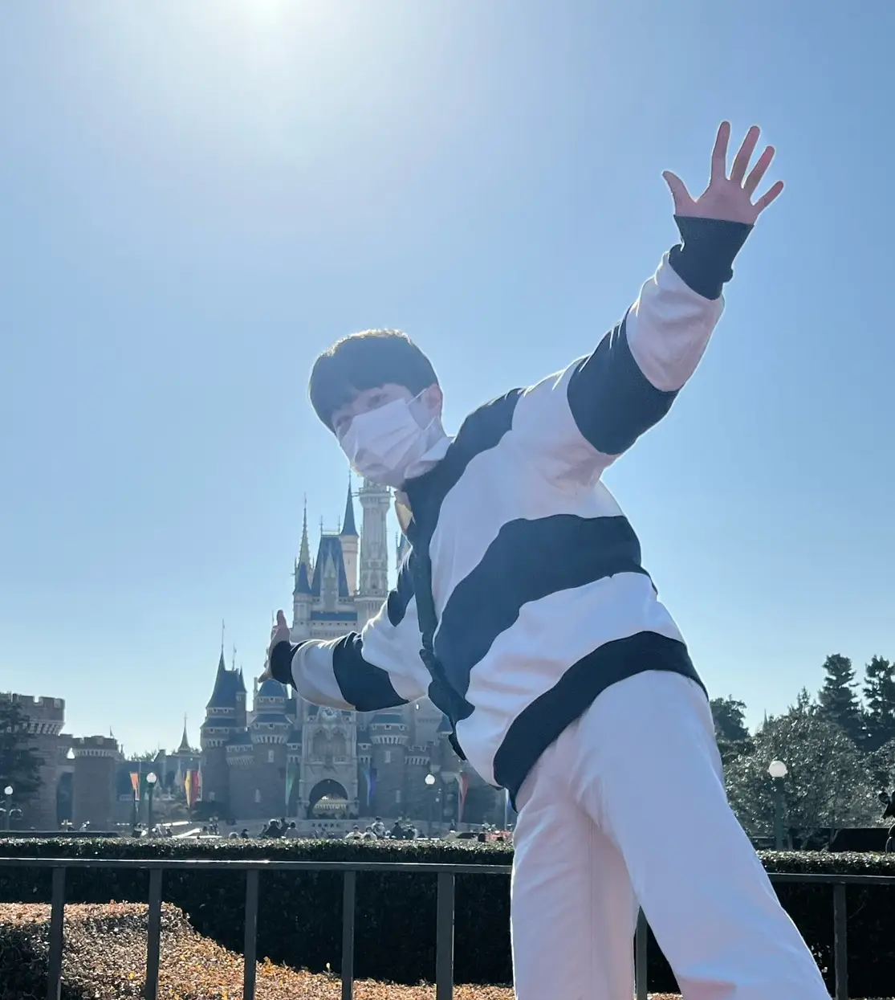

import Image from "../../components/Image";

<Image caption="도쿄 디즈니랜드 앞">
  
</Image>

### 사실은
건설현장에서 가장 중요하다고 말하는 것이 콘트리트 타설이다. (조금 그런 표현으로 공구리)  
기반이 되는 작업이기 때문이다. 숙련공의 단가가 제일 높은 것이 콘크리트 타설이기도 하다.  
제대로 된 타설과 그 콘크리트에 꽂은 지지대가 견고한 건물을 만드는 것이다.  
사실은 **"첫 글"** 이라서 대충 아무 말이나 해볼려고 했지만 **"첫 글"** 이기 때문에 더욱이 잘써놔야 할 것 같다.

### 요즘에는
회사일도 하고, 취미생활도 잘 즐기고, 연애도 잘 하고 있다. 최근 3년간 제일 행복한 것 같다.  
이런 시점에 옛날 생각을 해보니 고등학교를 졸업도 하기전에 바로 취업을 하였고,  
지금 직장에 오기 전 잠깐 2주정도 그리고 올해 초 1주정도 쉰게 내 최근 3년간 휴식의 전부다. <s>(어? 많이 쉰건가?)</s>  
꽤나 잘 달려왔다고 생각한다.

> 퇴근 이후, 주말에는 안쉬고 뭐하셨어요?

공부했다. 개발자라는 직업이 특히나 웹분야는 조금이라도 뒤쳐지면 큰일이다.  
트렌드가 워낙 빠르게 바뀌기 때문이다.  
요즘에는 Svelte 라는 프레임워크에 빠져서 평소보다 더 공부하고 있다.

### 앞으로는
평소에는 Notion(노션)에만 공부한 내용을 정리하고, 관리했다.  
앞으로는 블로그에 글을 작성하여 내가 배우고 이해한 내용을 널리 공유해야겠다.

***나만 잘 알고있으면 괜찮은거지~***

뭐.. 사실 맞는 말이지만, 배운 내용을 복습하면서 공유까지하면 모두가 행복하지 않을까?  
내가 도움을 받은것처럼 나도 도움을 줘야겠다.  
많이 늦은 올해의 결심