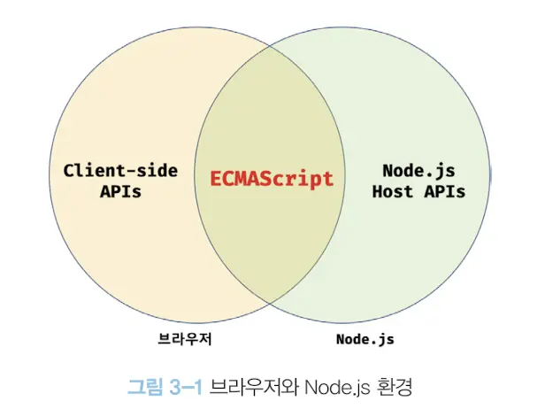

import Image from "../../../components/Image";

## JavaScript / ECMAScript

우리가 주의해야 할 점이 있다. 브라우저와 Node.js는 서로 용도가 다르다는 점이다.  
브라우저는 HTML, CSS, 자바스크립트를 브라우저 화면에 렌더링 하는 것이 주된 목적이지만,  
Node.js는 브라우저 외부에서 자바스크립트 실행환경을 제공하는것이 주된 목적이다.  
따라서 자바스크립트 코어인 ECMAScript를 실행할 수 있지만 브라우저와 Node.js에서  
ECMAScript 이외에 추가로 제공하는 기능은 호환되지 않는다.

<Image caption="브라우저와 Node.js 환경">
  
</Image>

|브라우저|Node.js|
|-----|-----|
|ECMAScript, [클라이언트 사이드 Web API](https://developer.mozilla.org/ko/docs/Web/API)(DOM, BOM Canvas, XMLHttpRequest, fetch, requestAnimationFrame SVG, Web Storage, Web Component, Web Worker)|ECMAScript, [Node.js 고유의 API](https://nodejs.org/dist/latest/docs/api)(process, fs, buffer, stream, v8)|