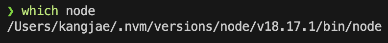
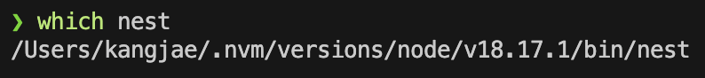
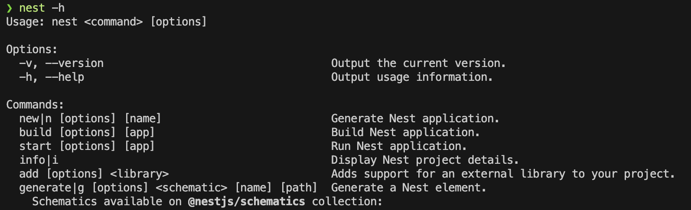
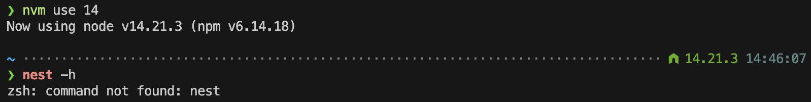

import Image from "../../components/Image";

### 서론
NVM으로 관리되는 Node.js는 버전을 새로이 설치할 때 마다 `{USER}/.nvm/versions/node` 하위에 `{VERSION}` 으로 설치된다. (like `/Users/kangjae/.nvm/versions/node/v18.17.1`)  
그렇다면 `npm`을 사용하여 Global에 Package를 설치하였을 때는 어떻게 될까? 이 내용을 조사했고 정리해두려한다.

### 기본적으로
NVM을 사용하여 Node.js를 설치하면 binaries(`bin`) 디렉토리 하위에 설치된다.  
(e.g. `{VERSION}/bin/node`, `{VERSION}/bin/npm`)

<Image caption="Like this.">
  
</Image>

### 결론
사실 별거 없다. 현재 사용중인 버전 하위에 같이 설치된다.

<Image caption="Like this.">
  
</Image>

<Image>
  
</Image>

당연하겠지만, 버전을 바꾸면 다른 버전에 의존하는 Global Package는 사용하지 못한다.

<Image>
  
</Image>