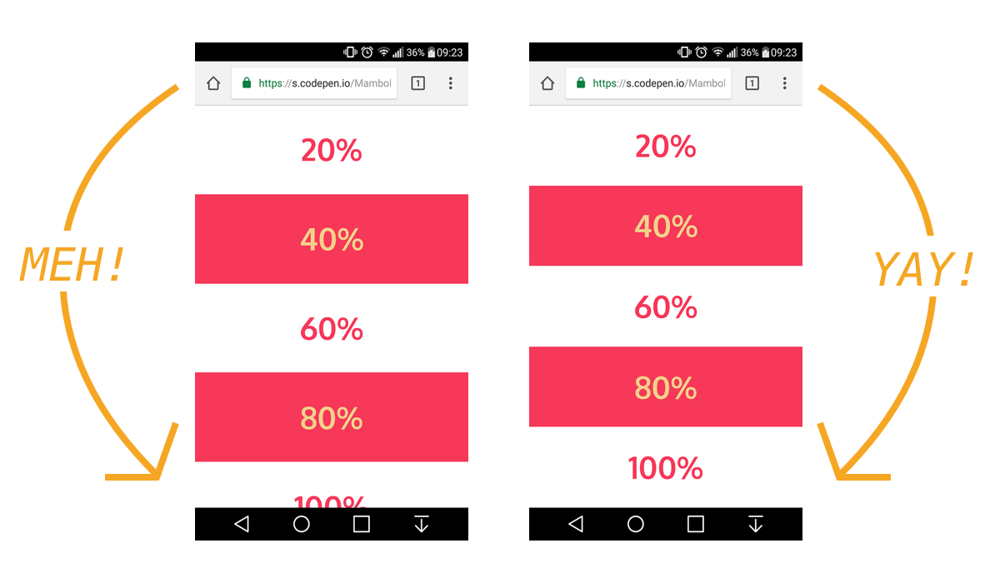

import Image from "../../components/Image";

### 알고는 있었지만...
Webkit Base의 브라우저에서는 z-index 이슈가 있다. <br />
예전부터 알고는 있었는데, 흥미롭고 새로운 해결방법을 찾아 정리해두려 한다.

추가로 Mobile Browser 모두의 문제일 수 있는데 Viewport Height(vh) 단위를 사용할 때 제대로 적용이 안되는 문제가 있다. <br />
이것도 해결해보려 한다.

### Viewport Height
#### 원인
<Image caption="in mobile browser">
  
</Image>
<Image caption="in my phone safari browser">
  
</Image>

위와 같이 모바일 브라우저에서는 상단/하단의 URL바, 툴바로 인해 화면의 크기(Viewport Height)가 가변적입니다. <br />
크기가 가변적이지만 그렇다고 100vh가 다시 계산되지는 않습니다. <br />
심지어 iOS Safari에서는 위에 이슈로 화면의 크기를 `window.innerHeight` 을 실제보다 크게 잡습니다. <br />
그렇기 때문에 Safari에서는 딱 맞춰서 코드를 작성하더라고 스크롤바가 생깁니다.

#### CSS + JS로 해결
React에서의 해결법을 작성해두려한다. 코드는 Pure JS 이기에 여타 다른 프레임워크/라이브러리에서도 활용가능하다.

```jsx title="React"
useEffect(() => {
  const vh = window.innerHeight * 0.01;
  document.documentElement.style.setProperty("--vh", `${vh}px`);
}, []);
```

스타일은 이렇게 작성하자.

```scss
& {
  height: 100vh; // 안좋은 방법...
  height: calc(var(--vh, 1vh) * 100); // 이렇게 사용하자!
}
```
전역 스타일은 이렇게 작성하자.
```scss
:root {
   --vh: 100%;
}

html,
body {
    height: 100vh;
    height: var(--vh);
}
```

#### CSS로만 해결
상당히 간단히 해결할 수 있다.
```scss
.target-element {
  min-height: 100vh;
  min-height: fill-available;
  min-height: -webkit-fill-available; // for Webkit(Chrome, Safari) based browser
  min-height: -moz-fill-available; // for Gecko(Firefox) based browser
}
```

### z-index
#### 원인
회사 프로젝트, 사이드 프로젝트 진행하면서 아주 밥먹듯이 발생했던 이슈인데, 특히나 Safari에서 특히나 많이 발생한다. <br />
이유는 Safari에서 UI를 렌더링할 때 2개 이상의 같은 `z-index` 를 가진 Element를 렌더링할 때 <br />
올바른 순서로 렌더링하지 않아 생기는 이슈라고 한다.

#### 해결
기본적으로 `z-index` Property는 `static` Value에서는 작동하지 않는다. <br />
`relative` , `absolute` , `fixed` Value들 에서만 작동한다.

보통의 상황에서는 `position` 으로 조정했다.
```scss
.first {
  width: 100%;
  height: 500px;

  position: relative;
  z-index: 1;
}
.second {
  width: 50%;
  height: 50%;
  position: absolute;
  top: 50%;
  left: 50%;

  transform: translate(-50%, -50%);
  z-index: 2;
}
.third {
  position: absolute;
  top: 50%;
  left: 50%;

  transform: translate(-50%, -50%);
  z-index: 3;
}
```

Chrome, Firefox에서는 해결이 잘 되었으나...
Safari에서는 추가적인 옵션이 필요하다.

```scss highlight=7,17,25
.first {
  width: 100%;
  height: 500px;

  position: relative;

  transform: translate3d(0, 0, 1px); // translating vector z값을 조정, z-index 값을 작성해준다.
  z-index: 1;
}
.second {
  width: 50%;
  height: 50%;
  position: absolute;
  top: 50%;
  left: 50%;

  transform: translate(-50%, -50%) translate3d(0, 0, 2px); // translating vector z값을 조정, z-index 값을 작성해준다.
  z-index: 2;
}
.third {
  position: absolute;
  top: 50%;
  left: 50%;

  transform: translate(-50%, -50%) translate3d(0, 0, 3px); // translating vector z값을 조정, z-index 값을 작성해준다.
  z-index: 3;
}
```

`translate3d` value로 Layer를 맨위로 올린다. `z-index` 랑 같은 효과이다. <br />
이렇게 작성하면 Safari에서도 이슈가 없다.
