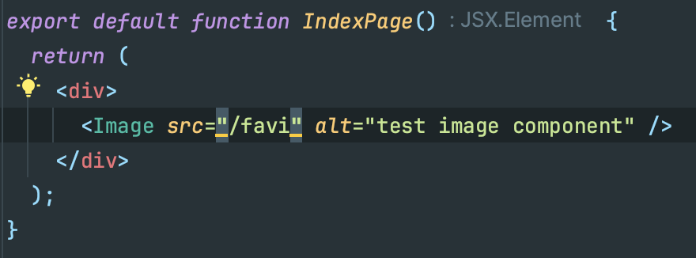

import Image from "../../../components/Image";

### 귀찮은 일
과거 고등학생 시절, 기능인재반 활동으로 기능경기대회를 준비하는 선수 생활을 할 때 일이었다.  
당시에는 기능경기대회 특유의 구시대 기술로 신기술을 구현해내는 대회과제 특성 상 흔한 말로 "노가다"와 같은 코드를 작성중이였다.
그때는 그게 최선이라고 생각을 했었다. 하지만 그 생각은 "수상"을 하신 선배님께서 도움을 주려 오셨을 때 박살이 나고 말았다.  
선배님은 우리의 코드를 보시고는 경악을 금치 못하고, 대대적인 리팩토링을 해주셨다.  
정말 큰 충격이였다. 내가 작성한 코드도 작동이 잘 되었고 채점을 하였을 때 낮은 점수도 아니였다.  
하지만 선배의 코드는 더욱이 간결하고 우아했으며 요청들을 아름답게 처리하고 있었다. 채점했을 때 낮은 점수도 아니였다.  
그것이 첫 번째 충격이였고 두 번째 충격은 선배님께서 하신 말씀이였다.  

> 반복적인 작업이 그렇게 시덥지 않다면 차라리 노가다를 하는게 낮다.

아.. 내가 어떤 부분이 부족하고 개선해 나가야될지 뼈저리게 느꼈다.

### 그 이후
사실 평소에도 귀찮은 일은 상당히 싫어했고, 귀찮은 일은 간단하게 스크립트를 짜서 컴퓨터에게 일을 넘기는 편이였다.  
이후에는 더 열심히 컴퓨터에게 일을 넘기려 다짐했다. (?)

### 지금은
4년차 개발자로 일을 하고 있는 지금 상황에서도 열심히 컴퓨터에게 일을 떠넘기고 있다.  
최근에는 퇴근 이후 혹은 주말에 재미삼아 Next.js + TypeScript 스펙으로 간단한 토이 프로젝트를 여럿 진행했다.  
외주도 같은 스펙으로 진행을 많이 하였다. 위 스펙으로 개발을 하다보면 걸리는 점이 하나있다.  

<Image caption="안된다.. 자동완성...">
  
</Image>

`/public` 디렉토리 하위에 있는 리소스들의 파일명 자동완성이 되지 않는다.  
당연한 결과다. 프레임워크가 어디서 어떻게 사용되고, 디렉토리 구조가 어떻게 결정될지도 모르는데 무턱대고 파일 시스템에 접근하는건 그게 멀웨어 아닌가?  
항상 `/public` 디렉토리 하위에 있는 리소스들을 찾아가며 직접 타이핑을 해주었다.  
너무 귀찮다.

### 그래서
내가 생각했을때는 특정 디렉토리의 리소스들을 모두 읽어들여 타입으로서 Export 해주면 정말 간편하게 사용할 수 있을 것 같았다.  
바로 실행에 옮겨봤다. 다음 글은 2부에서 마저 작성하려 한다.
