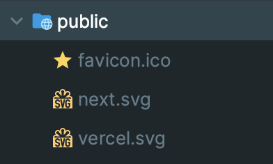
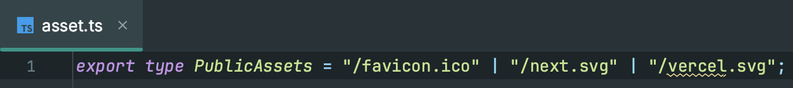
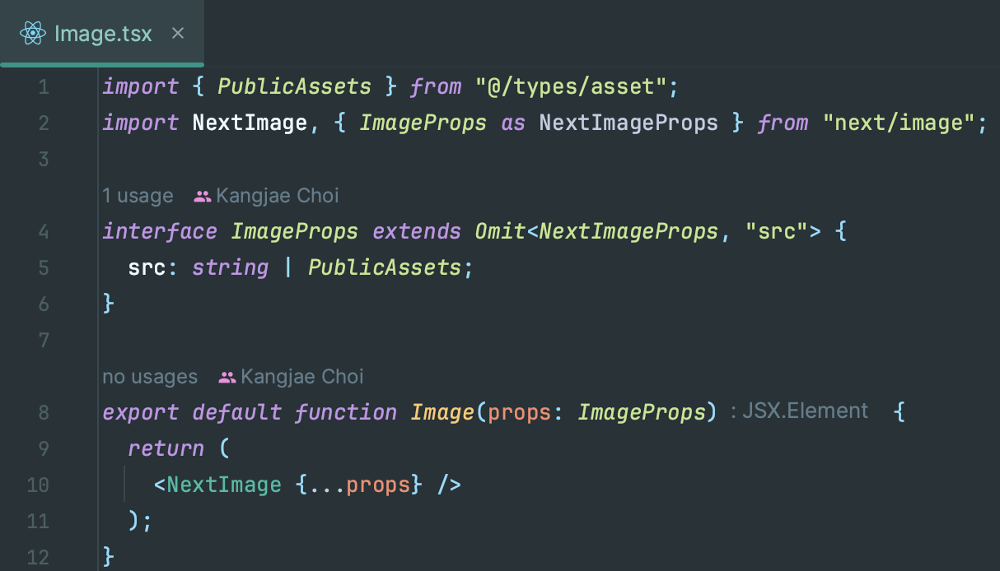
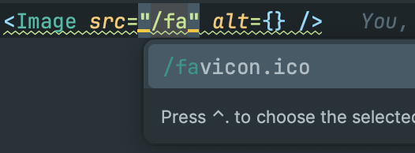

import Image from "../../../components/Image";

### 초기 세팅
기본적으로 `Node.js`는 설치되어 있어야 한다. Node.js Built-in Module을 사용한다. <br />
그 외 `ts-node`, `commander`를 설치해주어야 한다.
```bash
# 최종 Build에 포함 될 필요가 없기에 dev dependency로 둔다.
$ yarn add -dev ts-node commander
$ yarn add -D ts-node commander
```

이후 `package.json`, `tsconfig.json`을 수정해주어야 한다. <br />
스크립트가 ESM 방식으로 작성되어 있고, Custom Type을 Export하기에 수정이 필요하다.
```json title=package.json highlight=3,9
{
  "scripts": {
    "generate": "ts-node scripts/generate.ts", // Package Script 추가.
    "dev": "next dev",
    "build": "next build",
    "start": "next start",
    "lint": "next lint"
  },
  "type": "module" // ESM 방식 명시.
}
```
```json title=tsconfig.json highlight=19,21-24,25
{
  "compilerOptions": {
    "target": "es5",
    "lib": ["dom", "dom.iterable", "esnext"],
    "allowJs": true,
    "skipLibCheck": true,
    "strict": true,
    "noEmit": true,
    "esModuleInterop": true,
    "module": "esnext",
    "moduleResolution": "bundler",
    "resolveJsonModule": true,
    "isolatedModules": true,
    "jsx": "preserve",
    "incremental": true,
    "paths": {
      "@/*": ["./src/*"]
    },
    "typeRoots": ["node_modules", "./src/types/*"] // Root 명시.
  },
  // "ts-node"가 읽는 .ts 코드가 ESM 방식이라는 것임을 명시.
  "ts-node": {
    "esm": true
  },
  "include": ["next-env.d.ts", "**/*.ts", "**/*.tsx", "./src/types/*"], // Root 명시.
  "exclude": ["node_modules"]
}
```

### 코드 복사
세팅이 끝났다면 코드를 복사해오면 됩니다. <br />
`{PROJECT_ROOT}/scripts/generate.ts` 경로로 스크립트를 복사해줍니다. <br />
사실 위치와 파일명은 크게 상관이 없습니다. `package.json`을 같이 수정해주세요.
```ts title=scripts/generate.ts
import { Command } from "commander";
import * as fs from "fs";

const program = new Command();

// Please rewrite version when you edit this script.
const VERSION = "0.1.0";

program
  .name("generate-public-asset")
  .description("Generate typescript types and Next Image component using files in the /public directory")
  .version(VERSION, "-V, --version", "Print version");

...
```
모든 코드는 [여기](https://github.com/kangjae4real/generate-type-and-component-based-asset/blob/master/generate.ts)에서 볼 수 있습니다.

### 실행
실행은 위에서 작성한 Package Script를 활용하면 간편합니다. 항상 길게 쓸 필요가 없으니까요.
```bash
$ yarn generate
```
`-h, --help` 옵션으로 모든 명령어를 확인해볼 수 있습니다.
```bash
$ yarn generate -h
> Usage: generate-type-and-component-based-asset [options]

Generate typescript types and Next Image component using files in the /public directory

Options:
  -V, --version                       Print version
  -ED, --entryDir <path>              Directory entry point (default: "./public")
  -OD, --outputDir <path>             Directory output point (default: "./src/types")
  -OFN, --outputFileName <name>       Output file name (default: "asset")
  -WC, --withComponent                Output with component (default: false)
  -OCD, --outputComponentDir <path>   Output component entry point (default: "./src/components")
  -OCN, --outputComponentName <name>  Output component name (default: "Image")
  -WA, --withAlias                    Output component import path use alias | alias is '@/' (default: false)
  -h, --help                          display help for command
```
필수 옵션이 있습니다. <br />
`-ED --entryDir` 옵션으로 Entry point를 지정해주어야 합니다.
```bash
$ yarn generate -ED ./any/path
$ yarn generate --entryDir ./any/path
```
`-OD --outputDir` 옵션으로 Output point를 지정해주어야 합니다.
```bash
$ yarn generate -OD ./any/path
$ yarn generate --outputDir ./any/path
```
사실 Required Option이지만 Default value가 있어 Next.js 프로젝트라면 아무 옵션이 없어도 실행에 문제는 없습니다. <br />
하지만 그렇지 않다면, 꼭 입력해주어야 합니다.
```bash
$ yarn generate
$ yarn generate -ED ./any/path -OD ./any/path
```

### 실행 결과
```bash
$ yarn generate
> Read : ./public contents
Read Done! : ./public contents
Make Type
Make Type Done!
Write Type files : ./src/types/asset.ts
Write Type files Done! : ./src/types/asset.ts
```
<Image caption="/public contents">
  
</Image>
<Image caption="src/types/asset.ts">
  
</Image>
<Image caption="src/components/Image.tsx">
  
</Image>
코드의 작성된 Template대로 제대로 Export된다. 이제 간편하게 `<Image />` 컴포넌트를 Import하여 사용하면 된다.
<Image caption="Component Auto Complete">
  
</Image>
`/public` 디렉토리 하위에 요소들이 편안하게 자동완성이 된다. <br />
이제 `/public` 디렉토리 뒤적거리면서 하나하나 찾아볼 필요가 없어졌다.
