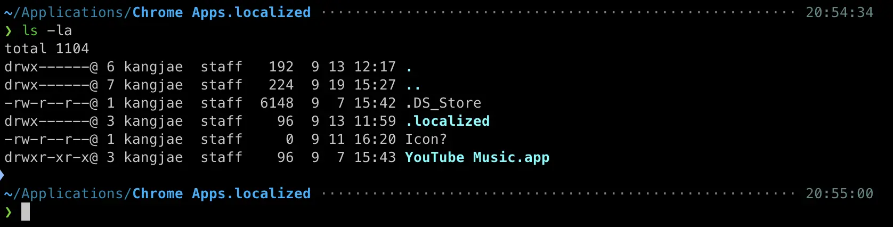

import Image from "../../../components/Image";

### 최근에...
이직준비 및 이직으로 최근 많이 바빠서 블로그 글을 쓰지 못했다. <br />
결론적으론, 2년간에 Tanker에서의 생활을 마치고 Xenoimpact로 이직을 했다.

### 이해되지 않는 Google Enterprise 계정 정책
이직을 하고나서 회사용 Google 계정을 발급받았다. <br />
지금까지 이런 적이 없었는데 Chrome에 로그인을 하게 되면, 원하지 않는 Google Application(이하, App)들이 설치된다. <br />
나는 진짜 원하지 않는 이상 이런 App들이 내 컴퓨터에 설치되는걸 정말 싫어한다. 이 App들은 쉽게 지울 수도 없게 되어있다. <br />
그래서 좀 찾아보니...

<Image caption="뭔...">
    
</Image>

최소한 사용자에게 선택권을 주는게 맞는 것 아닌가? <br />
아무튼 간편하게 이 App들을 지울 수 있는 간단한 Shell Script를 작성했다.

```shell
#!/bin/zsh

# 사용자 Home Directory로 이동한다.
# 권한 등의 Issue로 "cd" 명령이 실패하게 된다면 아래 문자열을 출력하고 프로세스를 종료한다.
cd $HOME/Applications || ! echo "Change Applications Directory Failed."

# Chrome Web App은 "Chrome Apps.localized" Directory의 설치된다.
# 권한 등의 Issue로 "cd" 명령이 실패하게 된다면 아래 문자열을 출력하고 프로세스를 종료한다.
cd Chrome\ Apps.localized || ! echo "Change Chrome Apps Directory Failed."

# 지우고 싶은 Google Application List
appNames=("Gmail.app" "Google 드라이브.app" "YouTube.app" "문서.app" "스프레드시트.app" "프레젠테이션.app")
# "appNames" 변수의 길이
appNamesLength=${#appNames[@]}

# 반복하여 지운다.
for (( i = 0; i < ${appNamesLength}; i++ ));
do
  if [[ -e ${appNames[$i]} ]];
  then
    # 파일이 존재한다면.
    echo "Is exists! ${appNames[$i]}"
    echo "Removing... ${appNames[$i]}"
    # 삭제
    rm -r "${appNames[$i]}" || echo "Remove ${appNames[$i]} Failed."
  else
    # 파일이 존재하지 않는다면.
    echo "File does not exists! ${appNames[$i]}"
  fi
done
```

<Image caption="결과">
    
</Image>

깔끔하게 잘 지워졌다 ㅎ

## 배운 점
- 파일명에 Space가 포함되어 있으면 명령에서 사용할 때 에러가 발생할 수 있다. <br />
이 부분은 문자열로 Wrapping해주면 해결된다.
- 여타 다른 프로그래밍 언어와는 다르게 조건식에 Flag를 사용할 수 있다. e.g. `-e` <br />
코드를 획기적으로 줄일 수 있고, 간편하다.
- 당연하겠지만, Target File은 확장자도 포함되어야 한다. 그렇지 않으면 에러가 발생한다.
- Shell Script는 일부 명령이 실행되지 않아도, 에러 출력을 하지 않는다. <br />
`||` 키워드로 실행되지 않았을 때(실패했을 때) 에러를 출력해줘야 한다.

## 참조
[Github](https://github.com/kangjae4real/auto-remove-chrome-app) <br />
[정책](https://support.google.com/chrome/a/answer/6306504?hl=ko&sjid=4583730764621665012-AP)
